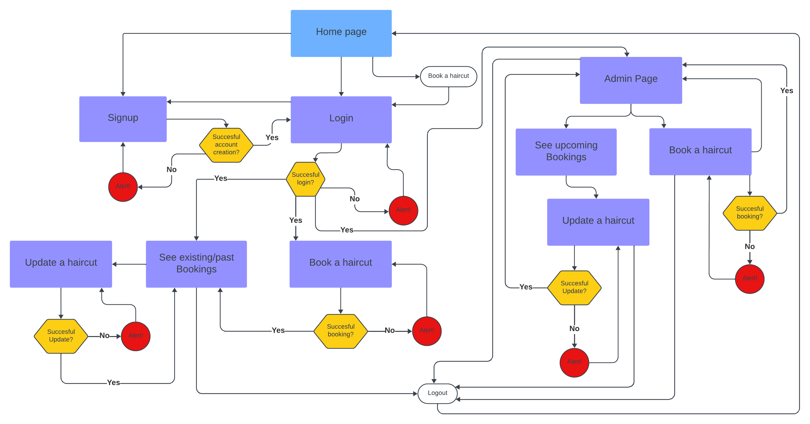
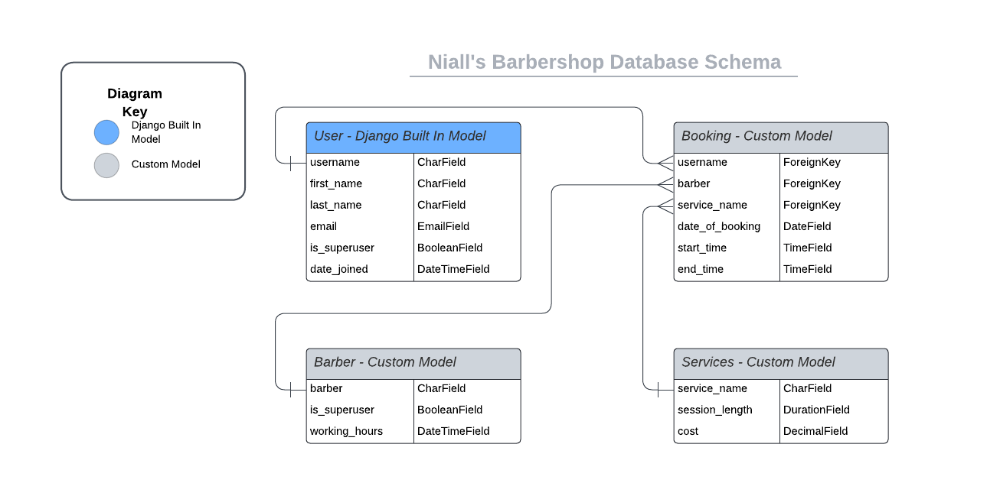
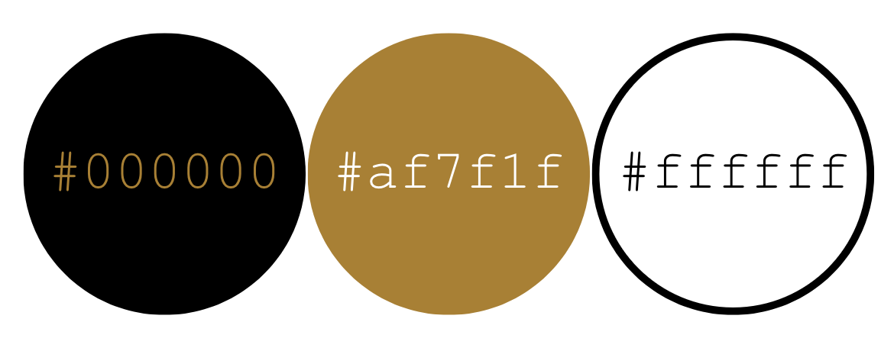

[GitHub Repo](https://github.com/DanMorriss/nialls-barbershop)

# Niall's Barbershop 
[Live Site](https://niallsbarbershop-e4e7dc2878db.herokuapp.com/)
 

Introduction.

## Table of contents
  * [Overview](#overview)
  * [UX](#ux)
    + [Strategy](#strategy)
    + [Scope](#scope-hr-)
    + [Structure](#structure-hr-)
    + [Skeleton](#skeleton-hr-)
    + [Surface](#surface-hr-)
      - [Color Scheme & Fonts](#color-scheme-and-fonts)
      - [Visual Effects](#visual-effects)
  * [Agile Methodology](#agile-methodology)
  * [Features](#features)
    + [Existing Features](#existing-features)
      - [Client bookints management](#client-bookings-management)
      - [Staff bookings management](#staff-bookings-management)
      - [Create bookings](#create-bookings)
      - [Menu](#menu)
      - [Information](#information)
    + [Potential Future Features](#pontential-future-features)
  * [Responsive Layout and Design](#responsive-layout-and-design)
  * [Tools Used](#tools-used)
    + [Python packages](#python-packages)
  * [Testing](#testing)
  * [Deployment](#deployment)
    + [Deploy on heroku](#deploy-on-heroku)
    + [FORK THE REPOSITORY](#fork-the-repository)
    + [CLONE THE REPOSITORY](#clone-the-repository)
  * [Credits](#credits)
    + [Content](#content)
    + [Media](#media)
    + [Code](#code)
  * [Acknowledgements](#acknowledgements)

## Overview
Overview.

## UX
This site was created according to the Five Planes Of Website Design: 
### Strategy

**User Stories:**  

|   EPIC                                |ID|                                User Story                                                   |
| :-------------------------------------|--|:------------------------------------------------------------------------------------------- |
|**Authentication**                     |  ||
|                                       |1A| As a site user I can|
|                                       |1B| As a site user I can|
|                                       |1C| As a site user I can|
|                                       |1D| As a site user I can|

**Project Goal:** 
To create a website with good UI and UX to promote Niall's Barbershop where potential customers can login and book an appointment. 

**Project Objectives:** 
- Create a sleek, modern website to promote Niall's Barbershop, containt all the information customers might want.
- Allow users to create an account.
- Allow users to see any available appointments and make a booking.
- Allow users to see their upcoming and past appointments.
- Allow users to cancel or modify an existing appointment.
- Allow staff to login to an admin area.
- Allow staff to view all upcoming booked appointments.
- Allow staff to view all site members.
- Allow staff to add new site member.
- Allow staff to create a booking for a customer.
- Allow staff to modify an existing booking.
- Allow staff to remove/cancel an existing appointment.
- Provide feedback to users when they have made changes.
- Show different site functionality to logged in members than to non logged in users.

### Scope

**Simple and Intuitive UX** 
- Create a website that portrays the mood and feel of the barbershop.
- Create a responsive navigation menu.
- Create a footer with social links and store location.
- Ensure that the user is visually notified of all changed to their account, eg booking conformation.
- Ensure that the user keeps their orientation throughout their website experience. 

**Relevant Content** 
- Make sure all the available haircut services are listed on the site.
- Display a map to the barbershop.
- Display only available time slots when booking a service.

**Responsiveness** 
- Create a responsive website that works on every device and screen size.  

### Structure

Introduction:

The main landing page...

#### Sitemap
The project flowcharts for the site structure was created using <b>LucidChart</b>.
https://lucid.app/lucidspark/555215a4-f33d-4e81-9a84-f9966d26e96c/edit?beaconFlowId=5B1214176B988F10&invitationId=inv_308a82e1-de92-41cb-8dec-6d03f4e7d8c1&page=0_0#

Sitemap:

 

### Skeleton

**Wireframes** 
The wireframes for mobile and desktop were created with [Balsamiq](https://balsamiq.com/) tool and can be viewed 

Here:

Homepage 
 
Login/Logout pages 
 
Book a haircut 
 

 

**Database**
The project uses ElephantSQL as PostgreSQL relational database for storing the data.
https://lucid.app/lucidchart/2e594f61-9a74-4848-9fe6-caf7fd3e236d/edit?beaconFlowId=57CA775DFDACD84D&invitationId=inv_4abd5981-3808-4cba-9b7c-974200dde00d&page=0_0# 

  
Model

 

 

### Surface
#### Color Scheme and Fonts

- The fonts I used for this site were imported from [Google Fonts](https://fonts.google.com/):
  - Sancreek for the headings
  - Tenor Sans for the body

- The colors used were based on the the colors in the logo.
  - #000000
  - #af7f1f
  - #ffffff

#### Visual Effects

* **Hover effects** 

  
NavBar

 

  
Bootstrap standard button hover effect

 

 
 

## Agile Methodology
This project was developed using the Agile methodology. 
All epics and user stories implementation progress was registered using [GitHub](https://github.com/). As the user stories were accomplished, they were moved in the GitHub Kanban board from **ToDo**, to **In Progress**, **Done** and **Not Implemented** lists.
The board can be viewed [here](https://github.com/users/DanMorriss/projects/5).

Sprint Details

- **KANBAN BOARD**  
      
- **EPIC 1 - BASE SETUP** 
    -1A Create 
      

  

## Features

### Existing Features and sub-pages

#### Feature 1

### Potential Future Features

## Responsive Layout and Design
How the breakpoints are set.

**Tested devices:**

    - iPhone 13
    - MacBook Pro 

## Tools Used

- [GitHub](https://github.com/) - used for hosting the source code of the program 
- [VS Code](https://code.visualstudio.com/) - for writing and testing the code 
- [Heroku](https://dashboard.heroku.com/) - used for deploying the project 
- [ElephantSQL](https://www.elephantsql.com/) - For PostgreSQL database 
- [Balsamiq](https://balsamiq.com/wireframes/) - for creating the wireframes 
- [Canva](https://www.canva.com/) - for images logo creation 
- [LucidChart](https://www.lucidchart.com/) - used for creating the Flowchart and Database relational schema 
- [Favicon.io](https://favicon.io/) - used for generating the website favicon 
- [TinyPNG](https://tinypng.com/) - for compressing the images 
- [Font Awesome](https://fontawesome.com/) - for the site's icons 
- [Bootstrap5](https://getbootstrap.com/) - for out of the box initial CSS styling 
- [Google Fonts](https://fonts.google.com/) - for typography 
- [Code Institute Pylint](https://pep8ci.herokuapp.com/) - used for validating the python code 
- [HTML - W3C HTML Validator](https://validator.w3.org/#validate_by_uri+with_options) - used for validating the HTML 
- [CSS - Jigsaw CSS Validator](https://jigsaw.w3.org/css-validator/#validate_by_uri) - used for validating the CSS 
- [Chrome Dev Tools](https://developer.chrome.com/docs/devtools/) - for debugging the project 
- [W.A.V.E.](https://wave.webaim.org/) - for testing accessibility 
- [Cloudinary](https://cloudinary.com/) - for storing static data 
Chrome LightHouse extension - for testing performance 

### Python packages

* Django (Framework)
* django-allauth (Library)
* django-bootstrap-datepicker-plus (Library)
* django-crispy-forms (Library)
* cloudinary (Library)
* gunicorn (Web Server)
* psycopg2 (Library)

## Testing
The testing documentation can be found at [TESTING.md](TESTING.md)

## Deployment

### Deploy on Heroku
 1. Create requirements.txt file 
 
 In the terminal enter the command ` pip3 freeze > requirements.txt`, and a file with all requirements will be created. 
 
 2. Setting up Heroku

    * Go to the Heroku website (https://www.heroku.com/) 
    * Login to Heroku and choose *Create App* 
    * Click *New* and *Create a new app*
    * Choose a name and select your location
    * Go to the *Resources* tab 
    * From the Resources list select *Heroku Postgres*
    * Navigate to the *Deploy* tab
    * Click on *Connect to Github* and search for your repository
    * Navigate to the *Settings* tab
    * Reveal Config Vars and add your Cloudinary, Database URL (from Heroku-Postgres) and Secret key.    

3. Deployment on Heroku

    * Go to the Deploy tab.
    * Choose the main branch for deploying and enable automatic deployment 
    * Select manual deploy for building the App 
    
### Fork the repository
For creating a copy of the repository on your account and change it without affecting the original project, use<b>Fork</b> directly from GitHub:
- On [My Repository Page](https://github.com/), press <i>Fork</i> in the top right of the page
- A forked version of my project will appear in your repository  

### Clone the repository
For creating a clone of the repository on your local machine, use<b>Clone</b>:
- On [My Repository Page](https://github.com/), click the <i>Code</i> green button, right above the code window
- Chose from <i>HTTPS, SSH and GitClub CLI</i> format and copy (preferably <i>HTTPS</i>)
- In your <i>IDE</i> open <i>Git Bash</i>
- Enter the command <code>git clone</code> followed by the copied URL
- Your clone was created

## Credits

- https://docs.djangoproject.com/en/3.2/ref/templates/builtins/#date 

### Content

### Media

### Code

- Help with Bootstrap from their [documentation](https://getbootstrap.com)
- Database setup and much more with [Codemy.com](https://www.youtube.com/watch?v=A1nqCgAM6CE)
- Automated testing with [CodingEntrepeneurs](https://www.youtube.com/watch?v=5E_xLmQXOZg)

## Acknowledgements

To log into the Heroku toolbelt CLI:

1. Log in to your Heroku account and go to _Account Settings_ in the menu under your avatar.
2. Scroll down to the _API Key_ and click _Reveal_
3. Copy the key
4. In Codeanywhere, from the terminal, run `heroku_config`
5. Paste in your API key when asked

You can now use the `heroku` CLI program - try running `heroku apps` to confirm it works. This API key is unique and private to you so do not share it. If you accidentally make it public then you can create a new one with _Regenerate API Key_.

---

Make sure to remove the DISABLE_COLLECTSTATIC config var from heroku before final deployment.