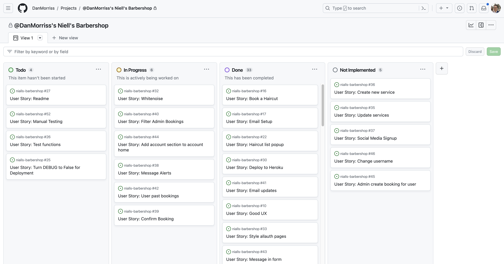

# Niall's Barbershop 
 
- [Live Site](https://niallsbarbershop-e4e7dc2878db.herokuapp.com/)
- [GitHub Repo](https://github.com/DanMorriss/nialls-barbershop)

Niall's Barbershop is a website with a booking system for a Barber Shop in Swindon, Wiltshire. 
The web application allows users to create an account, login and create a booking.
 

## Table of contents

## Overview
The site was created using Django and has full CRUD functionality and an intuitive UI to make the process of booking a haircut both easy and enjoyable. 
The user is notified of any change to their account or booking with an alert box and email notification where necessary. 
The user can see their past bookings and is notified when the booking has been conformed by the barber.
The admin users have extra functionality, being able to search bookings by date and username.

## UX
This site was created according to the Five Planes Of Website Design: 
### 1. Strategy

To create a website with good UI and UX to promote Niall's Barbershop where potential customers can login, book and update an appointment. 

The project objectives can be broken into Epics and then further into User Stories. To implement the user stories they were allocated into sprints.

- Project Setup
  - Create the initial Django application
  - Set file structure in accordance with Django common practices
  - Deefine and create the Database Models
  - Link custom CSS & JavaScript as well as Bootstrap
  - Create a base.html file for the other template to use
  - Link Google Fonts for custom fonts
- UX
  - Include a Favicon logo
  - Install Whitenoise to link up the custom styles
  - View a list of services with information
  - Style the default allauth pages
  - Create a Homepage
  - Include a contact section
  - Include 403, 500 & 404 pages
  - Allow users and admins to view past bookings
  - Display alerts and messages to the user
- Navigation
  - Have a Navbar that is the same across all the pages
  - Have a Footer that is the same across all the pages
- CRUD
  - View upcoming bookings
  - Book a haircut
  - Delete a booking
  - Enhanced Admin CRUD capabilities
  - Update a booking
- Authentication
  - Add user emails
  - Create User Account
  - Setup allauth
  - Allow users and admins to login
  - Send the users email notification when bookings are made, updated, deleted or confirmed
- Validation
  - Include validation in the booking form to make sure bookings are valid and the time is not already taken
- Administration
  - Allow admins to search for date of booking and user
  - Allow users to update their account details including email and password
  - Let admins conform bookings
- Deployment
  - Cloudinary
  - ElephantSQL
  - Heroku
  - Set Debug to False
- Testing
  - Unit Tests
  - Manual Testing
- Documentation
  - Readme

 

**Agile Methodology**  
This project was developed using the Agile methodology. 
All epics and user stories implementation progress was registered using [GitHub](https://github.com/). As the user stories were accomplished, they were moved in the GitHub Kanban board from **ToDo**, to **In Progress**, **Done** and **Not Implemented** lists.
The board can be viewed [here](https://github.com/users/DanMorriss/projects/5).

**Kanban Board**  
  

Sprint 1: Base Setup

|EPIC|User Story|Description|
|:--|:--|:--|
|Project Setup|Project setup|As a developer, I need to set up the project so that it is ready for implementing the core features.|
|Deployment|Cloiudinary|As a developer I need to setup a cloudinary account so that the image I need for the site can be hosted on an external database.|
|Deployment|ElephantSQL|As a developer I need to setup an ElephantSQL account so that my SQL database can be linked to the project.|
|Deployment|Heroku|As a developer I need to deploy the finished project to Heroku so that it can be accessed by everyone.|
|Project Setup|File structure|As a developer I need to set up the file structure in the project so that all the files can be accessed and created in the correct place.|
|Project Setup|Database models|As a developer I need to create the database models so that the can be used by the app.|
|Project Setup|Link CSS, JS & Bootstrap|As a developer I can link up boostrap and custom CSS & JavaScript into base.html so that the site can be styled.|
|Project Setup|base.html|As a developer I need to create the base.html page and structure so that other pages can use the layout.|
|Project Setup|Google Fonts|As a developer I can link in google fonts so that the site can have custom fonts.|
|UX|Favicon|As a developer I can add a favicon so the user can see the site logo easily in the web browser.|

 

Sprint 2: Navigation & Account Creation

|EPIC|User Story|Description|
|:--|:--|:--|
|**Project Setup**|||
|Navigation|Navbar|As a developer I need to create a navbar so that users can navigate the site.|
|CRUD|View upcoming bookings|"As a barber I can see all the upcoming appointments so that I know what work I have coming up.|
|Navigation|Footer|As a developer I need to create a footer so that users can find more information about the site.|
|UX|Whitenoise|As a developer I need to setup whitenoice so that my static files can be served in deployment.|
|Authentication|Add email address|As a site user I can supply my email address so that I will receive booking confirmation to my inbox.|
|Authentication|Create Account|As a site user I can create an account so that I can log in and create a booking.|
|Authentication|allauth|As a developer I need to inplement allauth so that user can signup and have access to the sites full features.|
|Authentication|Login|As a site member I can login to my account so that I can see my appointments (past and upcoming) and make a new booking.|

 

Sprint 3: Styling

|EPIC|User Story|Description|
|:--|:--|:--|
|CRUD|Book a haircut|As a logged in user I can book a haircut so that I can get a haircut.|
|UX|View sevices|As a site user I can view a list of the available haircuts with cost and how long it will take so that I can choose the correct service for me.|
|UX|Style allauth|As a site owner I should style the allauth pages so that they fit in with the styling of the rest of the site.|
|UX|Homepage|As a barber I would like a home page with information about my babershop so that customers can find out everything they need to about my shop.|
|UX|Contact Section|As a user I can easily see how to get in contact with the barbers so I can ask any questions.|
|UX|UX|As a site user I can experience good UX when visiting the site so that I am more likely to stay on the site and book a haircut.|

 

Sprint 4: CRUD

|EPIC|User Story|Description|
|:--|:--|:--|
|CRUD|Delete booking|As a logged in user I can delete a booking so that cancel my appointment if I can no longer make it.|
|CRUD|Admin CRUD|As a site admin I want to be able to create, edit, delete and view bookings for customers so that I can edit appointments for customers.|
|CRUD|Update booking|As a logged in user I can update my booking so that I can make changes if needed.|
|UX|403|As a developer I need to create a 403 page to redirect unauthorised users so that I can secure my views.|
|UX|500|As a developer I need to create a 500 page to alert users when an internal service error occurs.|
|UX|404|As a developer I need to create a 404 page so that users know when they visit a page that doesn't exist.|
|Validation|Booking validation|As a user I cannot book invalid appointments to I can turn up without any in person issues.|
|UX|Past Bookings|As a logged in user I can see all my upcoming and past bookings so that I can check how long it's been since my last appointment and see any upcoming bookings.|

 

Sprint 5: Search & Email

|EPIC|User Story|Description|
|:--|:--|:--|
|Administration|Admin search|As an admin I can filter and search the bookings so that I can find more relevant details easily.|
|Administration|Update account|As a user I can have more account details available to me so that I can update my account.|
|UX|Past Bookings|As a user I can see my past bookings so that I have a history of my haircuts.|
|CRUD|Message in booking form|As a user I can add a message to the booking form so that I can let the barber know of any special requirements I have.|
|UX|Message alerts|As a user I can see messages informing me of my actions so that I know I have logged in etc successfully.|
|Authentication|Email notification|As a user I can be notified by email when a modification has been made to my booking so that I know if any change has been made to my booking.|
|Administration|Admin confirm booking|As an admin I can confirm a booking so that I can make sure I am available.|

 

Sprint 6: Testing & Documentation

|EPIC|User Story|Description|
|:--|:--|:--|
|Testing|Unit Tests|As a developer I need to use testing so that I an sure my code is free of bugs and will not result in site errors.|
|Deployment|DEBUG to False|As a developer I need to set DEBUG to False before final deployment so that private information ins't available to the public.|
|Documentation|Readme|As a developer I need to complete a readme file so that my site is fully documented.|
|Testing|Manual Testing|As a developer I need to manually test the site to make sure everything works properly for the user.|

 

### 2. Scope

**Simple and Intuitive UX** 
- Create a website that portrays the mood and feel of the barbershop.
- Create a responsive navigation menu.
- Create a footer with social links.
- Include store location and opening times.
- Ensure that the user is visually notified of all changed to their account, eg booking conformation.
- Ensure that the user keeps their orientation throughout their website experience. 

**Relevant Content** 
- Make sure all the available haircut services are listed on the site.
- Display a map to the barbershop.
- Display only available time slots when booking a service.

**Responsiveness** 
- Create a responsive website that works on every device and screen size.  

### 3. Structure

The website is designed with the user in mind and once the user is logged in they have access to 7 different pages:
- Landing page
  - About
  - Services
  - Contact
- Account Home
- Past Bookings
- Booking Form
- Booking Details
- Update Email Address
- Change Password

There are also 2 pages available to users who aren't singed in:
- Create Account
- Login

#### Navigation

The navbar along the top of the page is always displayed, allowing the user to easily navigate around the site. The styling is consistent across the site but has different links on display for users that are signed in.
All users will see:
- Niall's Barbershop logo taking them to the landing page
- About
- Services
- Contact
- Book a Haircut

A user who isn't signed in will see:
- Register
- Login

A user who is signed in will see:
- My Account
- Logout

On smaller screen sizes a hamburger menu is displayed with a smooth dropdown effect. 

Each of the links had a hover effect where the color smoothly changes to indicate to the user it is an active link. 

#### Footer

The footer is the same across all the pages and includes:
- Social Media Icons (Facebook, Instagram, Github)
- A copyright statement

The active links have a hover effect where the color slowly changes from gold to white indicating to the user that the link is active. 

#### Pages

##### Landing Page

The landing page is divided into 4 sections:
- Hero Image  Logo
- About section
- Services section
- Contact Section

The main landing page has hero image with moving, interactive logo to spark the users interest right away.

Below the hero image is an about section giving the user some information about the barbershop.

Below the about section is some information on the different services available. Each one can be clicked on and a modal appears with more information about that service including a 'Book a Haircut' button.
The information on the different services is taken from the database, so an admin user can update it from the django admin panel.

At the bottom of the landing page is a contact section with address, opening times and a 'Book a Haircut' button.

If the user is logged in, the 'Book a Haircut' buttons will take them to the booking form. If the user isn't logged in they are redirected to the sign in page before arriving at the booking form.

##### Sign Up Page

This page uses the allauth page as a base with custom design added.
The username and password fields are mandatory but the email is optional. If the user signs up with and includes and email address they will be sent email updates on:
- Creating a booking
- Updating a booking
- Deleting a booking
- An admin confirming a booking

##### Sign In Page

This page uses the allauth page as a base with custom design added. It allows the user to sign in with either their username or email address (if they provided one).
It also includes a remember me button to make using the site in future easer, and a reset password link that will send the user a password reset email if they included an email when signing up.

##### Account Home Page

This page is displayed when the user first logs in, unless they clicked a "Book a Haircut" button before logging in.
On a large screen it is divided into 2 sections:
- Upcoming bookings
- Your Account

On a mobile device the two sections are stacked with the upcoming bookings at the top of the page.

Each booking is displayed on a card and contains:
- The date
- The service
- The time of the booking
- If the user added a message, a message icon
- The confirmation status of the booking

The card has a hover effect to indicate that it is a clickable link taking the user to the details of the booking.

The bookings are displayed in order starting from the one closest to the current date and time, descending as you go down the page. There is a link to view past bookings at the top of the list of bookings.

##### Admin Account Home Page

The account home page for an Admin user has the addition of a Search Bookings panel giving the admin user the ability to search by:
- Date of booking
- Username

If the number of bookings exceeds 25 the page paginates.

##### Booking Form

The booking form has 4 inputs:
- A date picker
- A haircut dropdown list
- A time dropdown list
- An optional message box

The form has built in validation alerting the user when an error has been made or the booking cannot be made. Reasons for an error include:
- Booking a date in the past
- Booking a time in the past
- Trying to book an appointment at a time that is already booked.

Once a successful booking has been made the user is taken back to the account home page and a success message is displayed at the top that disappears after 5 seconds. The booking will be displayed on the account home page for the user to see, but it will have a 'Not Yet Confirmed' message until an admin logs in and confirms the booking is okay.

##### Booking Detail Page
If a user clicks on a booking from the account home page they are taken to the account detail page that includes:
- Date
- Username (if an admin user)
- Appointment type
- Start time
- End time
- Message (if the user added one)
- The confirmation status
- A confirm booking button (if the user is admin and the booking is not yet confirmed)
- An edit appointment button
- A cancel appointment button
- A close button

User's View 
 
Admin's View 

##### Update Booking Page

If the user clicks on the edit appointment button on the booking detail page they are taken to a pre-populated booking form containing the details of the booking.
If a confirmed booking as amended the status goes back to 'Not Yet Confirmed' and a confirmation message is displayed to the user.

##### Confirm Delete Booking Page
 
If the user clicks on the 'Cancel Appointment' button on the booking detail page they are asked if they wish to delete the booking. If they confirm the deletion they are taken back to the account home page and displayed a confirmation message.

#### Sitemap
The project flowcharts for the site structure was created using [LucidChart](https://www.lucidchart.com/).

Sitemap:

 

### 4. Skeleton

**Wireframes**

The wireframes for mobile and desktop were created with [Balsamiq](https://balsamiq.com/) tool and can be viewed 

Here:

Homepage 
 
Login/Logout pages 
 
Book a haircut 
 

 

**Database**
The project uses ElephantSQL as PostgreSQL relational database for storing the data.

  
Model

   

 

### 5. Surface

#### Color Scheme and Fonts

- The fonts used for this site were imported from [Google Fonts](https://fonts.google.com/):
  - Sancreek for the headings
  - Tenor Sans for the body

- The colors used were based on the the colors in the logo.
  - #212529 --clr-gold
  - #af7f1f --clr-light
  - #faf8f2 --clr-dark

#### Visual Effects

**Hover effects** 
NavBar 
 
Footer 
 
Service Buttons 
 
Book a haircut button 
 
Booking card 
 
Booking Details Edit & Cancel Buttons 
 
Booking Details Close Button 
 

**Logo** 
Rotating Outer Logo with spinning effect when hovered 
 

## Features

### Existing Features

#### Haircut Information Modal
On the homepage the Services section includes a list of services taken from the database of services offered. Each services is displayed as a button and when clicked a modal is displayed containing information about the service including:
- Service name
- Description
- Cost
- A book haircut button

#### Book a haircut
The booking form has 4 inputs:
- A date picker
- A haircut dropdown list
- A time dropdown list
- An optional message box

The form has built in validation alerting the user when an error has been made or the booking cannot be made. Reasons for an error include:
- Booking a date in the past
- Booking a time in the past
- Trying to book an appointment at a time that is already booked.

Once a successful booking has been made the user is taken back to the account home page and a success message is displayed at the top that disappears after 5 seconds. The booking will be displayed on the account home page for the user to see, but it will have a 'Not Yet Confirmed' message until an admin logs in and confirms the booking is okay.

##### Booking List
Each booking is displayed on a card on the account home page and contains:
- The date
- The service
- The time of the booking
- If the user added a message, a message icon
- The confirmation status of the booking

##### Booking Detail Page
If a user clicks on a booking from the account home page they are taken to the account detail page that includes:
- Date
- Username (if an admin user)
- Appointment type
- Start time
- End time
- Message (if the user added one)
- The confirmation status
- A confirm booking button (if the user is admin and the booking is not yet confirmed)
- An edit appointment button
- A cancel appointment button
- A close button

##### Update Booking Page
If the user clicks on the edit appointment button on the booking detail page they are taken to a pre-populated booking form containing the details of the booking.
If a confirmed booking as amended the status goes back to 'Not Yet Confirmed' and a confirmation message is displayed to the user.

##### Confirm Delete Booking Page
If the user clicks on the 'Cancel Appointment' button on the booking detail page they are asked if they wish to delete the booking. If they confirm the deletion they are taken back to the account home page and displayed a confirmation message.

##### Admin Search Panel
Admin users have a Search Bookings panel on the account home page giving the admin user the ability to search by:
- Date of booking
- Username

##### Update Email
Users can update the email address attached to their account from the account panel in the account home page. They can:
- Add an email address
- Remove an email address
- Make an email address primary

##### Change Password
Users can change their password from the account panel in the account home page.

### Potential Future Features
- Allow admin users to edit the services from the account home rather than from the django backend panel
- Social media signup
- Add profile section where users can add a profile picture and update their username

## Responsive Layout and Design
The bootstrap grid system and flexbox was used to create a fully responsive layout and testing on multiple screen sizes and devices was carried out to make sure it each page looks good in many settings.

**Tested devices:**

- iPhone 13
- MacBook Pro
- Samsung Galaxy Z flip 5

## Tools Used

- [GitHub](https://github.com/) for hosting the source code of the program and version control
- [VS Code](https://code.visualstudio.com/) for writing and testing the code
- [Heroku](https://dashboard.heroku.com/) used for deploying the project
- [ElephantSQL](https://www.elephantsql.com/) for the PostgreSQL database
- [Balsamiq](https://balsamiq.com/wireframes/) for creating the wireframes
- [Canva](https://www.canva.com/) for creating the logo
- [LucidChart](https://www.lucidchart.com/) for creating the Flowchart and Database schema
- [Favicon.io](https://favicon.io/) for converting the sites favicon
- [Font Awesome](https://fontawesome.com/) for the site's icons
- [Bootstrap4](https://getbootstrap.com/) for the initial styling of of the site
- [Google Fonts](https://fonts.google.com/) for the typography
- [Code Institute Pylint](https://pep8ci.herokuapp.com/) for validating the python code
- [HTML - W3C HTML Validator](https://validator.w3.org/#validate_by_uri+with_options) for validating the HTML
- [CSS - Jigsaw CSS Validator](https://jigsaw.w3.org/css-validator/#validate_by_uri) for validating the CSS
- [Chrome Dev Tools](https://developer.chrome.com/docs/devtools/) for debugging the project
- [W.A.V.E.](https://wave.webaim.org/) for testing accessibility
- [Cloudinary](https://cloudinary.com/) for storing static data
- [Chrome LightHouse extension](https://developer.chrome.com/docs/lighthouse/overview/) for testing performance

### Python packages

- [Django](https://www.djangoproject.com/) was used as the framework for the site.
- [Allauth](https://django-allauth.readthedocs.io/) for the login authentication.
- [Crispy Forms](https://django-crispy-forms.readthedocs.io/) for help styling the forms.
- [Cloudinary](https://cloudinary.com/) for hosting the images.
- [Gunicorn](https://gunicorn.org/) for handling the HTTP requests in production.
- [Psycopg2](https://www.psycopg.org/) for aiding communication between Django and PostgresSQL
- [Formtools](https://django-formtools.readthedocs.io/) for additional form utilities.
- [Whitenoise](http://whitenoise.evans.io/en/stable/) for deploying the static files to Heroku.

A full list of the requirements and the versions used can be found in the reqquirements.txt file. To install them and run them on your own machine first setup a virtual environment with the command to create a venv...  
`python3 -m venv venv`  
Then this command to run it...  
`source venv/bin/activate`  
To stop running the environment simply type the command...  
`deactivate`

## Testing
Testing

## Bugs

- Adding the searchbox to the admin panel was causing a user to not be able to view the account home page. I all code related to the search panel inside an if statement to fix the error.
- While testing I needed to create a test service as the services list is taken from the database. So, without creating one nothing cloud be valid.
- Static files were not being issued on Heroku, I needed to install and setup whitenoise.
- On deployment, the email confirmations were causing an internal server error the user. I needed to give Heroku assess to the email password.
- When changes were pushed to git hub the static files stopped working. The command `collectstatic` needs to be run on any static changes and pushed to github.
- I had an issue linking up the urls when the name didn't have an underscore between the words. Changing the name `createbooking` to `create_booking` in urls.py fixed it.
- Adding whitenoise to MIDDLEWARE caused the project to break. It needed to be installed.
- When a booking was updated a new one was created and the old one was still in the database. The url needed to be removed from the form button so the form can complete it's function rather than creating a new booking.
- Validating the form to not alow past bookings was causing errors. The format for the time needed to be set properly. Using datetime.now().time() displayed the time properly.
- Allauth was not working, the order in MIDDLWARE was wrong, it needed to go at the end of the list.
- I had a different version of one of the requirements installed on my machine during a hackathon and when I tried to run the project again it didn't work. I setup a virtual environment (venv) to fix the issue.
- The nested if statements in the account home page was causing the searchbox to be hidden. The statements needed rearranging.
- Setting up email confirmation was causing an SMTPAuthenticationError. I needed to setup a special password that works with Django.
- The CreateBooking class wasn't working. There was type in the form_class attribute. It was set to from_class.

## Deployment

### Deploy on Heroku
 1. Create requirements.txt file 
 
 In the terminal enter the command ` pip3 freeze > requirements.txt`, and a file with all requirements will be created. 
 
 2. Setting up Heroku

    * Go to the Heroku website (https://www.heroku.com/) 
    * Login to Heroku and choose *Create App* 
    * Click *New* and *Create a new app*
    * Choose a name and select your location
    * Go to the *Resources* tab 
    * From the Resources list select *Heroku Postgres*
    * Navigate to the *Deploy* tab
    * Click on *Connect to Github* and search for your repository
    * Navigate to the *Settings* tab
    * Reveal Config Vars and add your Cloudinary, Database URL (from Heroku-Postgres) and Secret key.    

3. Deployment on Heroku

    * Go to the Deploy tab.
    * Choose the main branch for deploying and enable automatic deployment 
    * Select manual deploy for building the App 
    
### Fork the repository
For creating a copy of the repository on your account and change it without affecting the original project, use<b>Fork</b> directly from GitHub:
- On [My Repository Page](https://github.com/), press <i>Fork</i> in the top right of the page
- A forked version of my project will appear in your repository  

### Clone the repository
For creating a clone of the repository on your local machine, use<b>Clone</b>:
- On [My Repository Page](https://github.com/), click the <i>Code</i> green button, right above the code window
- Chose from <i>HTTPS, SSH and GitClub CLI</i> format and copy (preferably <i>HTTPS</i>)
- In your <i>IDE</i> open <i>Git Bash</i>
- Enter the command <code>git clone</code> followed by the copied URL
- Your clone was created

## Credits

### Content
All the content was created for the site by myself.

### Media
The logo was designed and created using [Canva](https://www.canva.com/en_gb/).

### Code

- Help with Bootstrap from their [documentation](https://getbootstrap.com)
- Django's docs have been invaluable:
  - [Date](https://docs.djangoproject.com/en/3.2/ref/templates/builtins/#date)
  - [Time](https://docs.python.org/3/library/time.html)
  - [Email](https://docs.djangoproject.com/en/3.2/topics/email/#email-backends)
  - [Q Objects and advanced queries](https://docs.djangoproject.com/en/3.2/topics/db/queries/#complex-queries-with-q-objects)
- Additional help with email authentication from this article on [Code Snail](https://www.codesnail.com/django-allauth-email-authentication-tutorial/)
- This article from [Stack Overflow](https://stackoverflow.com/questions/3728528/testing-email-sending-in-django) also helped with setting up email.
- The [Whitenoise Docs](https://whitenoise.readthedocs.io/en/stable/django.html)
- This link from [Stack Overflow](https://stackoverflow.com/questions/30244042/django-updateview-creates-a-new-object-instead-of-updating-the-current-object) helped when I was having issues updating a booking.
- This video by [BuyBytes](https://www.youtube.com/watch?v=8xb9s3jnRF8) of using a Form Wizard was useful, even though I didn't end up using it in the final deployment.
- This video from [Corey Schafer](https://www.youtube.com/watch?v=Kg1Yvry_Ydk) on using venv was great for understanding virtual environments.

## Acknowledgements

- Roman Rakic for his help on Slack with linking up my urls.
- Tomislav for his help understanding venv, cloudinary & how django works with static. His patience helping me understand the settings in a full stack application has been amazing.
- Precious Ijege my Code Institute mentor.
- Kent Yates for testing my application and supplying moral support.
- Selina Sheerin for her continued encouregment and keen eye for spelling and grammar mistakes. 

Make sure to remove the DISABLE_COLLECTSTATIC = 1 config var from heroku before final deployment.