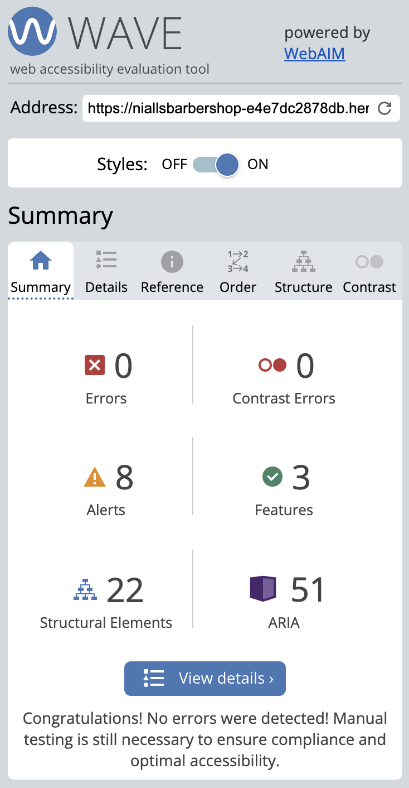

# Testing

* [Unit Testing](#unit-testing)
    + [TestBookingForm](#testbookingform)
    + [TestBookingSearchForm](#testbookingsearchform)
    + [TestBookingsListView](#testbookingslistview)
    + [TestPastBookingsView](#testpastbookingsview)
    + [EmailTest](#emailtest)
    + [TestCreateBookingView](#testcreatebookingview)
    + [TestUpdateBookingView](#testupdatebookingview)
    + [TestBookingDetailView](#testbookingdetailview)
    + [TestBookingDeleteView](#testbookingdeleteview)
    + [TestConfirmBookingView](#testconfirmbookingview)
* [Manual Testing](#manual-testing)
    + [User Story: Favicon](#user-story--favicon)
    + [User Story: Deployed site](#user-story--deployed-site)
    + [User Story: List of Services](#user-story--list-of-services)
    + [User Story: Allauth pages styled](#user-story--allauth-pages-styled)
    + [User Story: Homepage](#user-story--homepage)
    + [User Story: 403 page](#user-story--403-page)
    + [User Story: 404 page](#user-story--404-page)
    + [User Story: View past bookings](#user-story--view-past-bookings)
    + [User Story: View Past Bookings for Admin User](#user-story--view-past-bookings-for-admin-user)
    + [User Story: Display messages to the user](#user-story--display-messages-to-the-user)
    + [User Story: Navbar](#user-story--navbar)
    + [User Story: Footer](#user-story--footer)
    + [User Story: View  Upcoming bookings](#user-story--view--upcoming-bookings)
    + [User Story: View Upcoming Bookings for Admin user](#user-story--view-upcoming-bookings-for-admin-user)
    + [User Story: View Booking Details](#user-story--view-booking-details)
    + [User Story: Book a haircut](#user-story--book-a-haircut)
    + [User Story: Delete a booking](#user-story--delete-a-booking)
    + [User Story: Update a booking](#user-story--update-a-booking)
    + [User Story: User email](#user-story--user-email)
    + [User Story: Create user account](#user-story--create-user-account)
    + [User Story: Login](#user-story--login)
    + [User Story: Logout](#user-story--logout)
    + [User Story: Booking validation](#user-story--booking-validation)
    + [User Story: Admin can search by date](#user-story--admin-can-search-by-date)
    + [User Story: Admin can search by username](#user-story--admin-can-search-by-username)
    + [User Story: Update Email](#user-story--update-email)
    + [User Story: Change Password](#user-story--change-password)
    + [User Story: Confirm bookings](#user-story--confirm-bookings)
* [Accessibility](#accessibility)
* [Validator Testing](#validator-testing)
* [Lighthouse Reports](#lighthouse-reports)
* [Responsiveness](#responsiveness)
* [Browser Compatibility](#browser-compatibility)

## Unit Testing

Automated unit tests have been written and used, they can all be found in the following locations:
 - booking_system > test_forms.py
 - booking_system > test_views.py
 - home > test_views.py

 The following command will run the tests:  
 `python3 manage.py test`

[Back to Top](#testing)

### TestBookingForm

The following tests have been written for the BookingForm class:
- test_the_form_works: Test the setup and basic functionality of the form.
- test_date_of_booking_is_required: Test that the date of booking is a required field.
- test_date_cannot_be_in_past: Test that the date of booking cannot be in the past.
- test_service_name_is_required: Test that the service name is a required field.
- test_start_time_is_required: Test that the start time is a required field.
- test_start_time_cannot_be_in_the_past: Test that the start time cannot be in the past.
- test_fields_are_explicit_in_form_meta_class: Test that form fields are explicitly defined in the Meta class.

[Back to Top](#testing)

### TestBookingSearchForm

The following tests have been written for the BookingSearchForm class.
- test_return_all_future_bookings: Test returning all future bookings.
- test_search_by_username: Test searching bookings by username.
- test_search_by_date: Test searching bookings by date.

[Back to Top](#testing)

### TestBookingsListView

The following tests have been written for the BookingsListView view.
- test_redirect_to_login_if_not_logged_in: Test redirection to login if not logged in.
- test_if_admin_gets_all__future_bookings: Test if admin gets all future bookings.
- test_user_is_shown_their_future_bookings: Test if the user is shown their future bookings.

[Back to Top](#testing)

### TestPastBookingsView

The following tests have been written for the PastBookingsView view.
- test_redirect_to_login_if_not_logged_in: Test redirection to login if not logged in.
- test_only_past_bookings_shown: Test only past bookings are shown.

[Back to Top](#testing)

### EmailTest
The following tests have been written for the email functionality.
- test_send_email_confirmation: Test sending email confirmation.

[Back to Top](#testing)

### TestCreateBookingView
The following tests have been written for the CreateBookingView view.
- test_load_booking_form: Test loading the booking form.
- test_user_must_be_logged_in: Test that the user must be logged in.

[Back to Top](#testing)

### TestUpdateBookingView
The following tests have been written for the UpdateBookingView view.
- test_load_booking_form: Test loading the booking form.
- test_user_must_be_booking_owner: Test that the user must be the booking owner.
- test_user_must_be_logged_in: Test that the user must be logged in.

[Back to Top](#testing)

### TestBookingDetailView
The following tests have been written for the BookingDetailView view.
- test_load_booking_detail: Test loading the booking detail.
- test_user_must_be_booking_owner: Test that the user must be the booking owner.
- test_user_must_be_logged_in: Test that the user must be logged in.

[Back to Top](#testing)

### TestBookingDeleteView
The following tests have been written for the BookingDeleteView view.
- test_user_cant_delete_another_users_booking: Test that the user can't delete another user's booking.
- test_user_can_delete_their_own_booking: Test that the user can delete their own booking.
- test_admin_can_delete_bookings: Test that the admin can delete bookings.

[Back to Top](#testing)

### TestConfirmBookingView
The following tests have been written for the ConfirmBookingView view.
- test_admin_can_confirm_booking: Test that the admin can confirm a booking.
- test_users_cant_confirm_bookings: Test that regular users can't confirm bookings.

[Back to Top](#testing)

## Manual Testing

### User Story: Favicon

Description:
- A favicon has been added to the website, and it should appear on every page of the site. This will help users identify the website easily from the browser.

Steps:
- View the tab in different browsers:
    - Chrome
    - Firefox
    - Safari

Expected:
- Favicon is displayed

Actual:
- As expected

[Back to Top](#testing)

### User Story: Deployed site

Description:
- The user can view the deployed site.

Steps:
1. Go to [the deployed site](https://niallsbarbershop-e4e7dc2878db.herokuapp.com/)
2. View the site

Expected:
- Site loads without errors

Actual:
- As expected

[Back to Top](#testing)

### User Story: List of Services

Description:
- The user can view a list of all the services offered by the barbershop

Steps:
1. Go to the landing page
2. Navigate to the 'Services' section
3. Click on one of the services

Expected:
- A list of services is displayed
- Clicking on a service will display a modal with more information including:
    - Service name
    - Description
    - Cost
    - Link to book a haircut

Actual:
- As expected

[Back to Top](#testing)

### User Story: Allauth pages styled

Desription:
- A user will see all pages with brand styling including all allauth forms and pages

Steps:
- Naviagte to the following pages a check style continuity:
    - Login
    - Signup
    - Update email
    - Change password
    - Logout

Expected:
- All pages style is in keeping with the rest of the site

Actual:
- As expected

[Back to Top](#testing)

### User Story: Homepage

Description:
- A user can view details of the barbershop without logging in

Steps:
1. Go to the [landing page](https://niallsbarbershop-e4e7dc2878db.herokuapp.com/)
2. Find the following sections:
    1. Hero image and logo
    2. Welcome/about section
    3. Haircuts/services
    4. Contact
    5. Header
    6. Footer

Expected:
- All sections are present to a non-logged-in user

Actual:
- As expected

[Back to Top](#testing)

### User Story: 403 page

Description:
- A user will see a custom 403 page when they try to access a forbidden page

Steps:
1. A logged-in-user should navigate to a booking that is not theirs

Expected:
- Custom 403 page is displayed

Actual:
- As expected

[Back to Top](#testing)

### User Story: 404 page

Description:
- A user will see a custom 400 page when they try to access a page that is not part of the site

Steps:
1. A user should add some random letter to the end of the url

Expected:
- Custom 404 page is displayed

Actual:
- As expected

[Back to Top](#testing)

### User Story: View past bookings

Description:
- A user can view their past bookings

Steps:
- From the My Account page click on the 'past bookings' button
- View all past bookings

Expected:
- All past bookings are displayed including:
    - Date
    - Service name
    - Time
    - Message icon (if a message is attached to the booking)
- If more than 25 bookings have been made page pagination will be on display
    - Next >>
    - << Prev

Actual:
- As expected

[Back to Top](#testing)

### User Story: View Past Bookings for Admin User

Description:
- An admin user can view all past bookings

Steps:
1. Go to the My Account page
2. Click 'Past Bookings'
3. View all the past bookings

Expected:
- All bookings are in the past and include:
    - Date
    - Service name
    - Time
    - User
    - Message (if a message is attached to the booking)
- If more than 25 bookings have been made page pagination will be on display
    - Next >>
    - << Prev

[Back to Top](#testing)

### User Story: Display messages to the user

Description:
- A user will be shown a message at the top of the screen indication any changes to their account.

Possible Steps:
1. Login
2. Create a booking
3. Update a booking
4. Delete a booking
5. Logout
6. Confirm a booking (admin)

Expected:
- A message is displayed to the user

Actual:
- As expected

[Back to Top](#testing)

### User Story: Navbar

Description:
- A navbar is on display to the user across all pages

Steps:
1. View all pages
2. Check navbar is on display
3. Check links work

Expected:
- Navbar is always on display
- Niall's Barbershop takes you to the landing page
- About takes you to the about section on the landing page
- Services takes you to the haircuts section on the landing page
- Contact takes you to the contact section on the landing page
- Book a haircut takes you to: 
    - the booking form if logged in
    - the login page if not logged in, then the booking form
- Register takes you to the signup page
- Login takes you to the login page
- My account takes logged in users to their account home page
- Logout takes logged in users to the logout page

Actual:
- As expected

[Back to Top](#testing)

### User Story: Footer

Description:
- A footer is on display to the user across all pages

Steps:
1. View all pages
2. Check footer is on display

Expected:
- Footer is always on display
- The links all work:
    - Facebook takes the user to the facebook page for the barbershop in a new window
    - Instagram takes the user to instagram in a new window
    - Github takes the user to the GItHub for the developer's github profile in a new window

Actual:
- As expected

[Back to Top](#testing)

### User Story: View  Upcoming bookings

Description:
- The user can view all their upcoming bookings

Steps:
- Go to the My Account page from the navbar
- See the bookings in the Upcoming Bookings section

Expected:
- All future bookings are displayed including:
    - Date
    - Service name
    - Time
    - Message icon (if a message is attached to the booking)
    - Confirmation status

Actual:
- As expected

[Back to Top](#testing)

### User Story: View Upcoming Bookings for Admin user

Description:
- An admin user can view all upcoming bookings

Steps:
1. Go to the My Account page
2. View all the upcoming bookings

Expected:
- All bookings are in the future and include:
    - Date
    - Service name
    - Time
    - User
    - Message icon (if a message is attached to the booking)
    - Confirmation status
- If more than 25 bookings have been made page pagination will be on display
    - Next >>
    - << Prev

Actual:
- As expected

[Back to Top](#testing)

### User Story: View Booking Details

Description:
- A user can view the details of a booking

Steps:
- From the My Account page click on a booking card
- View the booking details

Expected:
- Details of the bookings will be shown:
    - Date
    - Service
    - Start time
    - End time
    - Message (if there is one)
    - Confirmation status
- Modification buttons will be available for the user to:
    - Edit Appointment
    - Cancel Appointment

Actual:
- As expected

[Back to Top](#testing)

### User Story: Book a haircut

Description:
- A logged in user can book a haircut

Steps:
1. Click a "book a haircut" button or select it from the navbar
2. Select a date from the date picker
3. Select a haircut from the dropdown menu
4. Select a time from the dropdown menu
5. Add a message (optional)
6. Click 'Book'

Expected:
- If a past date is selected an error message is shown saying 'Please select a date in the future'
- If a time in the past is shown an error message is shown saying 'Please select a time in the future'
- The user is redirected to the account home page
- The booking is displayed with the 'Not yet confirmed' message on the upcoming bookings section
- An email confirmation is sent to the user (if they have an email address associated with their account)

Actual:
- As expected

[Back to Top](#testing)

### User Story: Delete a booking

Description:
- A user can delete their booking

Steps:
1. Select 'Cancel Appointment' from the booking detail page
2. Select 'Yes, delete my booking'

Expected:
- The user is redirected to the account home page
- A message saying 'Your booking has been successfully deleted' is displayed to the user
- A confirmation email is sent to the user (if they have an email address attached to their account)

Actual:
- As expected

[Back to Top](#testing)

### User Story: Update a booking

Description:
- A user can update their booking

Steps:
1. Click on 'Edit Appointment' from the booking detail page
2. Update the booking details

Expected:
- The user cannot someone elses appointment
- The user is taken a pre-populated booking from containing the boooking information
- The user changes any of the information with the same stipulations as when creating a new booking
- The user is redirected to the account home page
- A success message is shown to the user
- A confirmation email is sent to the user (if they have an email address attached to their account)
- The status is reset to 'not yet confirmed'

Actual:
- As expected

[Back to Top](#testing)

### User Story: User email

Description:
- Users will receive email notifications when changes are made to their bookings

Steps:
1. Add an email address to a users account
2. Make, update or delete a booking

Expected:
- Emails will be sent to the relevant recipients

Actual:
- As expected

[Back to Top](#testing)

### User Story: Create user account

Description:
- A user can sign up by accessing the sign-up form and entering their details.

Steps:
1. Go to the register page
2. Enter the requested details
3. Click Sign Up

Expected: 

- Email should be optional, but if entered a confirmation email should be received by the user
- A username should be unique
- A password should comply with the regulations
- Send to account home upon successful sign-up

Actual:
- As expected, error messages displayed when incorrect or invalid data entered, confirmation email received and redirected to account home.

[Back to Top](#testing)

### User Story: Login

Description:
- A user can login with their account details and be redirected to the account home page, unless the "book a haircut" button as clicked prior to login; in that case the user should be directed to the booking form.
- Upon successful login a success message should be displayed to the user.

Steps:
1. Go to the login page
2. Enter username or email and password
3. Click 'Sign In'

Expected:
- The user is directed to the account home page
- A success message is displayed at the top of the screen saying "Successfully signed in as `username`

Actual:
- As expected

[Back to Top](#testing)

### User Story: Logout

Description:
- The user can logout successfully.

Steps:
1. Click the 'Logout' button from the navbar
2. Click 'Sign Out'

Expected:
- The user is logged out and redirected to the landing page
- A message is displayed saying "You have signed out"

Actual:
- As expected

[Back to Top](#testing)

### User Story: Booking validation

Description:
- Users will not be able to make invalid bookings

Steps:
1. Try to book an appointment on a date in the past
2. Try to book an appointment at a past time on todays date
3. Try to book an appointment at the same time as another booking

Expected:
- Errors will be displayed to the user and the booking form will not be sent to the database.

Actual:
- As expected

[Back to Top](#testing)

### User Story: Admin can search by date

Description:
- Admin users can search upcoming bookings by date

Steps:
1. On the account home page in the search bookings section select a date from the date picker
2. Click 'search'

Expected:
- The bookings on the selected date will be displayed
- If no bookings are on the selected date 'No upcoming bookings' will be displayed

Actual:
- As expected

[Back to Top](#testing)

### User Story: Admin can search by username

Description:
- Admin users can search upcoming bookings by username

Steps:
1. On the account home page in the search bookings section type a username (or part of a username)
2. Click 'search'

Expected:
- The bookings for the user(s) with the entered username will be displayed
- If no bookings are found 'No upcoming bookings' will be displayed

Actual:
- As expected

[Back to Top](#testing)

### User Story: Update Email

Description:
- A user can update the email address associated with their account.

Steps:
- Click 'Update Email' from the Account section of the Account home page
- Add a (new) email address in the add email field
- Click 'Add email'
- Check your inbox
- Follow the verification link in the email
- Click 'confirm'
- Go back to the 'Update email' page
- Select the (new) email address
- Click 'make primary'

Expected:
- A success message to be shown when email confirmed

Actual:
- As expected

[Back to Top](#testing)

### User Story: Change Password

Description:
- A user can up update the password associated with their account

Steps:
- Click 'Change Password' from the Account section of the Account home page
- Type your current password
- Type a new password 
- Type the new password again
- Click 'Change password'

Expected:
- A message saying 'Password successfully changed.' is displayed to the user

Actual:
- As expected

[Back to Top](#testing)

### User Story: Confirm bookings

Description:
- An admin can confirm a booking for a user

Steps:
1. Click on a booking card with a confirmation status of 'Not yet confirmed' from the admin account home
2. Click 'Confirm Booking'

Expected:
- The admin will be redirected to account home
- A success message will be displayed
- The booking status changes to 'Booking Confirmed'
- A confirmation email will be send to the user (if an email address is associated with the account)

Actual:
- As expected

[Back to Top](#testing)

## Accessibility

[Wave Accessibility](https://wave.webaim.org/) tool was used throughout development and for final testing of the deployed website to check for any aid accessibility testing.

Testing was focused to ensure the following criteria were met:

- All forms have associated labels or aria-labels so that this is read out on a screen reader to users who tab to form inputs
- Color contrasts meet a minimum ratio as specified in [WCAG 2.1 Contrast Guidelines](https://www.w3.org/WAI/WCAG21/Understanding/contrast-minimum.html)
- Heading levels are not missed or skipped to ensure the importance of content is relayed correctly to the end user
- All not textual content had alternative text or titles so descriptions are read out to screen readers
- HTML page lang attribute has been set
- Aria properties have been implemented correctly
- WCAG 2.1 Coding best practices being followed

[Back to Top](#testing)

## Validator Testing

All pages were run through the [w3 HTML Validator](https://validator.w3.org/).

The Django templating language would not allow the files to be pasted into the validator and as some of the pages were restricted due to login or admin access I used the Chrome DevTools to copy the HTML content and paste that into the validator.

All pages were run through the [Code Institute Pylint](https://pep8ci.herokuapp.com/) validator to ensure all code was pep8 compliant.

JavaScript code was run through [JSHINT](https://jshint.com) javascript validator.

This had warnings about the use of let, but as this code came from the Code Institute walkthrough project I assumed it acceptable.

[Back to Top](#testing)

## Lighthouse Reports
All lighthouse reports for all pages came back with a score of at least 91, you can see the full reports below.

Landing Page 

Account Home 

Booking Detail 

Booking Form 

Logout 

Sign Up 

Log In 

[Back to Top](#testing)

## Responsiveness

All pages were tested to ensure responsiveness on screen sizes from 320px and upwards as defined in WCAG 2.1 Reflow criteria for responsive design on Chrome, Firefox and Safari.

Steps to test:

- Open browser and navigate to [Niall's Barbershop](https://niallsbarbershop-e4e7dc2878db.herokuapp.com/)
- Open the developer tools (right click and inspect)
- Set to responsive and decrease width to 320px
- Click and drag the responsive window slowly to maximum width

Expected:

Website is responsive on all screen sizes and no images are pixelated or stretched. No horizontal scroll is present. No elements overlap.

Actual:

Website behaved as expected.

[Back to Top](#testing)

## Browser Compatibility

The following browsers were used to test the site:
- Google Chrome
- Firefox
- Safari

[Back to Top](#testing)