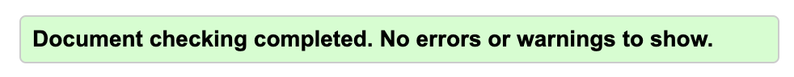
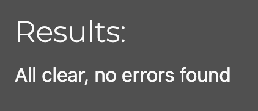

# Testing

## Unit Testing

Automated unit tests have been written and used, they can all be found in the following locations:
 - booking_system > test_forms.py
 - booking_system > test_views.py
 - home > test_views.py

## User Testing

## Accessibility

[Wave Accessibility](https://wave.webaim.org/) tool was used throughout development and for final testing of the deployed website to check for any aid accessibility testing.

Testing was focused to ensure the following criteria were met:

- All forms have associated labels or aria-labels so that this is read out on a screen reader to users who tab to form inputs
- Color contrasts meet a minimum ratio as specified in [WCAG 2.1 Contrast Guidelines](https://www.w3.org/WAI/WCAG21/Understanding/contrast-minimum.html)
- Heading levels are not missed or skipped to ensure the importance of content is relayed correctly to the end user
- All not textual content had alternative text or titles so descriptions are read out to screen readers
- HTML page lang attribute has been set
- Aria properties have been implemented correctly
- WCAG 2.1 Coding best practices being followed

## Validator Testing

All pages were run through the [w3 HTML Validator](https://validator.w3.org/).

The Django templating language would not allow the files to be pasted into the validator and as some of the pages were restricted due to login or admin access I used the Chrome DevTools to copy the HTML content and paste that into the validator.

All pages were run through the [Code Institute Pylint](https://pep8ci.herokuapp.com/) validator to ensure all code was pep8 compliant.

JavaScript code was run through [JSHINT](https://jshint.com) javascript validator.

This had warnings about the use of let, but as this code came from the Code Institute walkthrough project I assumed it acceptable.

## Lighthouse Report

## Responsiveness

All pages were tested to ensure responsiveness on screen sizes from 320px and upwards as defined in WCAG 2.1 Reflow criteria for responsive design on Chrome, Firefox and Safari.

Steps to test:

- Open browser and navigate to [Niall's Barbershop](https://niallsbarbershop-e4e7dc2878db.herokuapp.com/)
- Open the developer tools (right click and inspect)
- Set to responsive and decrease width to 320px
- Click and drag the responsive window slowly to maximum width

Expected:

Website is responsive on all screen sizes and no images are pixelated or stretched. No horizontal scroll is present. No elements overlap.

Actual:

Website behaved as expected.
