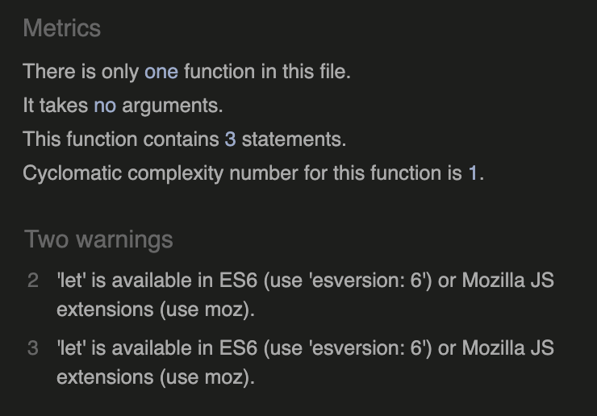

# Testing

## Unit Testing

Automated unit tests have been written and used, they can all be found in the following locations:
 - booking_system > test_forms.py
 - booking_system > test_views.py
 - home > test_views.py

### TestBookingForm

The following tests have been written for the BookingForm class:
- test_the_form_works: Test the setup and basic functionality of the form.
- test_date_of_booking_is_required: Test that the date of booking is a required field.
- test_date_cannot_be_in_past: Test that the date of booking cannot be in the past.
- test_service_name_is_required: Test that the service name is a required field.
- test_start_time_is_required: Test that the start time is a required field.
- test_start_time_cannot_be_in_the_past: Test that the start time cannot be in the past.
- test_fields_are_explicit_in_form_meta_class: Test that form fields are explicitly defined in the Meta class.

### TestBookingSearchForm

The following tests have been written for the BookingSearchForm class.
- test_return_all_future_bookings: Test returning all future bookings.
- test_search_by_username: Test searching bookings by username.
- test_search_by_date: Test searching bookings by date.

### TestBookingsListView

The following tests have been written for the BookingsListView view.
- test_redirect_to_login_if_not_logged_in: Test redirection to login if not logged in.
- test_if_admin_gets_all__future_bookings: Test if admin gets all future bookings.
- test_user_is_shown_their_future_bookings: Test if the user is shown their future bookings.

### TestPastBookingsView

The following tests have been written for the PastBookingsView view.
- test_redirect_to_login_if_not_logged_in: Test redirection to login if not logged in.
- test_only_past_bookings_shown: Test only past bookings are shown.

### EmailTest
The following tests have been written for the email functionality.
- test_send_email_confirmation: Test sending email confirmation.

### TestCreateBookingView
The following tests have been written for the CreateBookingView view.
- test_load_booking_form: Test loading the booking form.
- test_user_must_be_logged_in: Test that the user must be logged in.

### TestUpdateBookingView
The following tests have been written for the UpdateBookingView view.
- test_load_booking_form: Test loading the booking form.
- test_user_must_be_booking_owner: Test that the user must be the booking owner.
- test_user_must_be_logged_in: Test that the user must be logged in.

### TestBookingDetailView
The following tests have been written for the BookingDetailView view.
- test_load_booking_detail: Test loading the booking detail.
- test_user_must_be_booking_owner: Test that the user must be the booking owner.
- test_user_must_be_logged_in: Test that the user must be logged in.

### TestBookingDeleteView
The following tests have been written for the BookingDeleteView view.
- test_user_cant_delete_another_users_booking: Test that the user can't delete another user's booking.
- test_user_can_delete_their_own_booking: Test that the user can delete their own booking.
- test_admin_can_delete_bookings: Test that the admin can delete bookings.

### TestConfirmBookingView
The following tests have been written for the ConfirmBookingView view.
- test_admin_can_confirm_booking: Test that the admin can confirm a booking.
- test_users_cant_confirm_bookings: Test that regular users can't confirm bookings.

## Manual Testing

### User sign up

Description:
A user can sign up by accessing the sign-up form and entering their details.

Steps:
1. Go to the register page
2. Enter the requested details
3. Click Sign Up

Expected: 
- Email should be optional, but if entered a confirmation email should be received by the user
- A username should be unique
- A password should comply with the regulations
- Send to account home upon successful sign-up

Actual:
As expected, error messages displayed when incorrect or invalid data entered, confirmation email received and redirected to account home.

### User login 

Description:
A user can login with their account details and be redirected to the account home page, unless the "book a haircut" button directed them to the login page. Upon successful login a success message should be displayed to the user.

Steps:
1. 
Expected:
Actual:

### User logout

Description:
Steps:
Expected:
Actual:

### User book a haircut

Description:
Steps:
Expected:
Actual:

### User view upcoming bookings

Description:
Steps:
Expected:
Actual:

### User view past bookings

Description:
Steps:
Expected:
Actual:

### User view booking details

Description:
Steps:
Expected:
Actual:

### User update booking

Description:
Steps:
Expected:
Actual:

### User delete booking

Description:
Steps:
Expected:
Actual:

### User update email

Description:
Steps:
Expected:
Actual:

### User change password

Description:
Steps:
Expected:
Actual:

### Admin view upcoming bookings

Description:
Steps:
Expected:
Actual:

### Admin view past bookings

Description:
Steps:
Expected:
Actual:

### Admin confirm booking

Description:
Steps:
Expected:
Actual:

### Admin delete booking

Description:
Steps:
Expected:
Actual:

### Admin update booking

Description:
Steps:
Expected:
Actual:

### Admin search by date

Description:
Steps:
Expected:
Actual:

### Admin search by username

Description:
Steps:
Expected:
Actual:

## Accessibility

[Wave Accessibility](https://wave.webaim.org/) tool was used throughout development and for final testing of the deployed website to check for any aid accessibility testing.

Testing was focused to ensure the following criteria were met:

- All forms have associated labels or aria-labels so that this is read out on a screen reader to users who tab to form inputs
- Color contrasts meet a minimum ratio as specified in [WCAG 2.1 Contrast Guidelines](https://www.w3.org/WAI/WCAG21/Understanding/contrast-minimum.html)
- Heading levels are not missed or skipped to ensure the importance of content is relayed correctly to the end user
- All not textual content had alternative text or titles so descriptions are read out to screen readers
- HTML page lang attribute has been set
- Aria properties have been implemented correctly
- WCAG 2.1 Coding best practices being followed

## Validator Testing

All pages were run through the [w3 HTML Validator](https://validator.w3.org/).

The Django templating language would not allow the files to be pasted into the validator and as some of the pages were restricted due to login or admin access I used the Chrome DevTools to copy the HTML content and paste that into the validator.

All pages were run through the [Code Institute Pylint](https://pep8ci.herokuapp.com/) validator to ensure all code was pep8 compliant.

JavaScript code was run through [JSHINT](https://jshint.com) javascript validator.

This had warnings about the use of let, but as this code came from the Code Institute walkthrough project I assumed it acceptable.

## Lighthouse Reports
All lighthouse reports for all pages came back with a score of at least 91, you can see the full reports below.

Landing Page 

Account Home 

Booking Detail 

Booking Form 

Logout 

Sign Up 

Log In 

## Responsiveness

All pages were tested to ensure responsiveness on screen sizes from 320px and upwards as defined in WCAG 2.1 Reflow criteria for responsive design on Chrome, Firefox and Safari.

Steps to test:

- Open browser and navigate to [Niall's Barbershop](https://niallsbarbershop-e4e7dc2878db.herokuapp.com/)
- Open the developer tools (right click and inspect)
- Set to responsive and decrease width to 320px
- Click and drag the responsive window slowly to maximum width

Expected:

Website is responsive on all screen sizes and no images are pixelated or stretched. No horizontal scroll is present. No elements overlap.

Actual:

Website behaved as expected.
